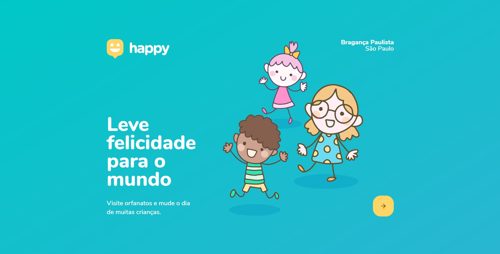

<h1 align="center">
    
</h1>

  <a href="#rocket-tecnologias">Technologies</a>&nbsp;&nbsp;&nbsp;|&nbsp;&nbsp;&nbsp;
  <a href="#-projeto">Project</a>&nbsp;&nbsp;&nbsp;|&nbsp;&nbsp;&nbsp;
  <a href="#-layout">Layout</a>&nbsp;&nbsp;&nbsp;|&nbsp;&nbsp;&nbsp;
  <a href="#memo-licença">License</a>

  

 

  

## 🚀 Technologies

This project was developed using the following technologies:

- [React]()
- [React Native]()
- [Node.js](https://nodejs.org/en/)
- [Express](https://expressjs.com/pt-br/)
- [SQLite](https://www.sqlite.org/index.html)

## 💻 Project

Happy is a project that aims to facilitate visits to orphanages near you 💜 

This is a project developed during the **[Next Level Week](https://nextlevelweek.com/)**, performed by **[@Rocketseat](https://github.com/Rocketseat)** during the 12th to 18th of October 2020.

## 🔖 Layout

You can view the layout of the project through the links below:

- [Layout Web](https://www.figma.com/file/mDEbnoojksG4w8sOxmudh3/Happy-Web?node-id=0%3A1) 
- [Layout Mobile](https://www.figma.com/file/X27FfVxAgy9f5IFa7ONlph/Happy-Mobile?node-id=0%3A1) 

## 📝 License

This project is under the MIT license. See the [LICENSE](LICENSE.md)  file for more details.

---

Developed with 💜 by Jhonatan Paschoal

